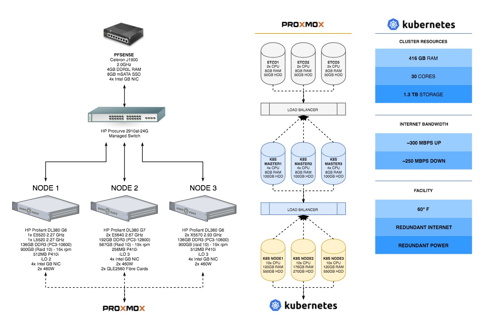

# radium cluster

 

## Purpose

The purpose of this repository is to demonstrate the tooling I use to provision (and manage) my homelab kubernetes cluster &mdash; from scratch. This repository is an adapted approach based on Kelsey Hightower's [kubernetes the "hard" way](https://github.com/kelseyhightower/kubernetes-the-hard-way).

## Goals

Running an on-prem cluster can be difficult &mdash; especially running an on-prem Kubernetes cluster. The main goals of these ansible plays are:

1. To introduce (and manage) a highly available on-prem cluster
1. Demonstrate best practices for running a kubernetes cluster
1. Keep things clear and simple for others to grok

## Cluster Specifications

### Software

This cluster bootstraps 3 etcd nodes, 3 kubernetes masters and 3 kubernetes nodes.

| Name | Version |
|:-----|:-------:|
| [kubernetes](https://github.com/kubernetes/kubernetes) (all components) | 1.9.0-alpha.2 |
| [romana](http://romana.io/) (cni) | v2.0 |
| [kube-dns](https://github.com/kubernetes/kubernetes/tree/master/cluster/addons/dns) (dns) | 1.14.4 |
| [influxdb](https://www.influxdata.com/) (monitoring) | 1.3.3 |
| [heapster](https://github.com/kubernetes/heapster) (monitoring) | 1.4.0 |
| [kubernetes-dashboard](https://github.com/kubernetes/dashboard) (dashboard) | 1.7.1 |
| [rook](https://rook.io/) (storage) | 0.5.1 |
